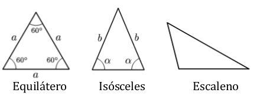

## Descrição
Os triângulos mais simples são classificados de acordo com os limites das proporções relativas de seus lados:

Um triângulo equilátero possui todos os lados congruentes ou seja iguais. Um triângulo equilátero é também equiângulo: todos os seus ângulos internos são congruentes (medem 60°), sendo, portanto, classificado como um polígono
regular.

Um triângulo isósceles possui pelo menos dois lados de mesma medida e dois ângulos congruentes. O triângulo equilátero é, conseqüentemente,
um caso especial de um triângulo isósceles, que apresenta não somente dois, mas todos os três lados iguais, assim como os ângulos, que medem
todos 60º. Num triângulo isósceles, o ângulo formado pelos lados congruentes é chamado ângulo do vértice. Os demais ângulos
denominam-se ângulos da base e são congruentes.

Em um triângulo escaleno, as medidas dos três lados são diferentes. Os ângulos internos de um triângulo escaleno também possuem medidas
diferentes.

                                                  
Sua missão é escrever um programa para classificar um triângulo de lados de comprimentos dados em: escaleno (os três lados de comprimentos diferentes), isósceles (dois lados de comprimentos iguais) ou equilátero (os três lados de comprimentos iguais).

## Formato de entrada

A entrada consiste de 03 números reais maiores que zero correspondendo ao comprimento dos lados do triângulo.

## Formato de saída

A saída deve ser: "escaleno", "isosceles" ou "equilatero" seguido de um final delinha.
Obs.: as aspas acima não devem ser impressas e a saída deve ser impressa sem acentos.