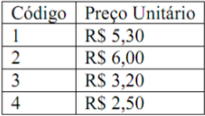

## Descrição

Ambrósio é amigo da vizinhança e resolveu dar descontos para agradar seus clientes. A mercearia de Ambrósio contém apenas 04 itens, cujos preços são dados pela tabela abaixo:

A regra de desconto é bem simples: se a quantidade de produtos comprados for igual ou maior que quinze, então o desconto é concedido. O desconto também é concedido caso o valor total da compra seja maior ou igual a 40 reais.
O valor do desconto é de 15%.
Sua missão é fazer um programa que leia o código do produto, a quantidade comprada e imprima o valor que o cliente deve pagar, já considerando o desconto quando aplicável.
Considere que o cliente só pode comprar um único tipo produto cada vez que usar o seu software.

## Formato de entrada

Um número inteiro correspondendo ao código do produto, seguido de um inteiro indicando a quantidade comprada.
Os inteiros são separados por um final de linha.

## Formato de saída

A saída deve conter o seguinte formato:
R$ x
Onde x corresponde a um número real formatado com duas casas decimais, indicando o valor a ser pago pelo cliente.
A sua saída deve ser seguida de um final de linha.
Obs.: perceba que existe um espaço entre o $ e o número x.  